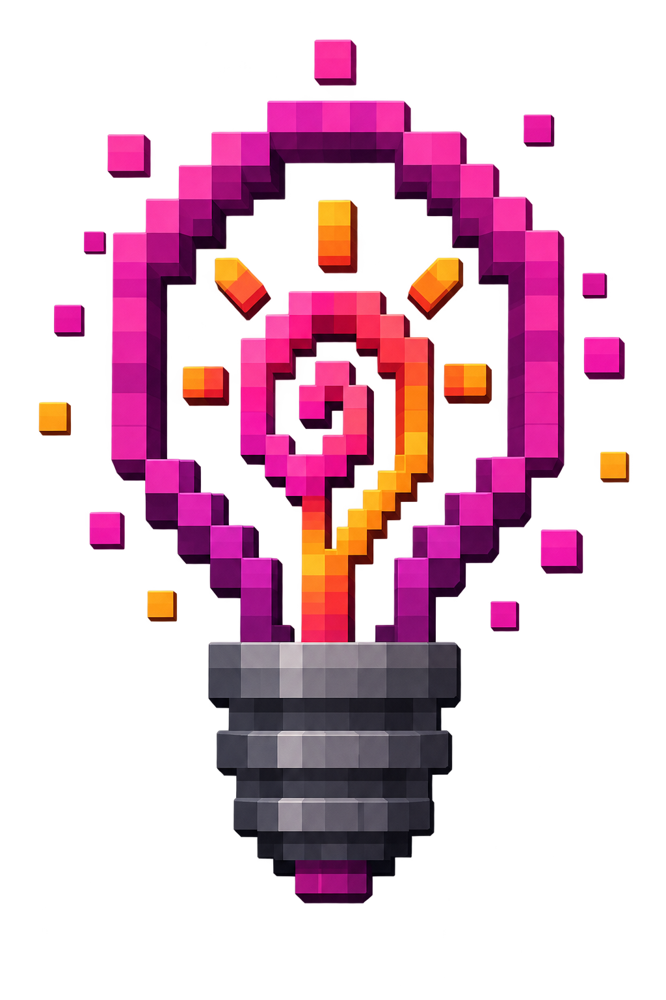

# LumiaCraft

  

LumiaCraft connects [Lumia Stream](https://lumiastream.com/) to Minecraft. Lumia alerts, rewards, chat commands, Stream Deck buttons, and automations can safely affect the game, while Minecraft events such as damage, healing, deaths, potion effects, and player joins can trigger normal Lumia alerts and actions.

One Lumia plugin works with every supported bridge. No Twitch credentials are stored in Minecraft, and the default single-player setup needs no RCON, Bukkit plugin, exposed port, or copied connection code.

## Downloads

Download the ready-to-use files from the [latest GitHub release](https://github.com/darylbwickham-design/LumiaCraft/releases/latest).

For the in-progress modpack expansion, use the clearly labelled [0.3.1 Modpack Beta files](releases/LumiaBridge-0.3.1-Modpack-Beta). These are separate from the stable release and should be tested in a copied instance first.

1. Import `lumiacraft-0.3.0.lumiaplugin` into Lumia Stream and enable it.
2. Put exactly one bridge JAR in the Minecraft instance's `mods` folder—the file matching both the Minecraft version and mod loader.
3. For Fabric, also install Fabric API.
4. Start or join a world. The local bridge connects automatically on `127.0.0.1:38931`.

Minecraft project downloads and updates are also available from [Hungry_Williams64 on CurseForge](https://www.curseforge.com/members/hungry_williams64/projects).

## Supported Minecraft versions

| Minecraft | Loader | Java | Typical packs/use |
| --- | --- | --- | --- |
| 1.21.1 | NeoForge | 21 | Modern NeoForge packs |
| 1.21.1 | Fabric + Fabric API | 21 | Modern Fabric packs |
| 1.20.1 | Forge | 17 | Create and TARDIS-era packs |
| 1.20.1 | Fabric + Fabric API | 17 | Fabric 1.20.1 packs |
| 1.18.2 | Forge | 17 | FTB Inferno-era packs |
| 1.19.2 | Forge | 17 | **Beta:** large 1.19.2 Forge packs |
| 1.19.2 | Fabric + Fabric API | 17 | **Beta:** Fabric 1.19.2 packs |
| 1.12.2 | Forge | 8 | ATM3 and SkyFactory-era packs |
| 1.10.2 | Forge | 8 | SkyFactory 3-era packs |
| 1.7.10 | Forge | 8 | FTB Presents SkyFactory 2.5 |

## Features

- Spawn vanilla or modded mobs and give items.
- Apply effects, damage players, and change time or weather.
- Show titles, action-bar messages, and chat messages using Lumia variables.
- Run bounded random command pools, timed sequences, and chaos presets.
- Trigger native Lumia alerts from damage, healing, health changes, deaths, respawns, potion changes, joins, leaves, and dimension changes.
- Use exact potion IDs as Lumia alert variations.
- Optionally relay Lumia's unified Twitch, YouTube, and other connected chat into Minecraft as `displayname: message`, with username fallback.
- Expose bridge version, connection state, health, and event counters as Lumia variables for troubleshooting.

## Server use

The bridge is server-authoritative and works in an integrated single-player server or a dedicated modded server.

- If Lumia and the server run on the same computer, keep the defaults.
- For a remote Lumia computer, change `bind` in `config/lumia-bridge.json`, restart the server, and copy the generated bridge token into the LumiaCraft settings.
- Permit TCP port `38931` only from the Lumia computer. Do not expose the bridge directly to the public internet.
- LumiaCraft can target or filter a player by Minecraft username where the relevant action or alert supports it.

Run `/lumiabridge status` in Minecraft to see the endpoint, connected Lumia clients, and published event count. Operators can run `/lumiabridge test` to publish a harmless test-damage alert without changing health.

## Safety

The bridge binds to localhost by default. Remote binds require a generated token. Minecraft enforces an allow-list of command roots, while the Lumia plugin validates identifiers and player names, bounds counts and durations, rate-limits actions, and keeps raw commands disabled by default.

See [the Lumia plugin guide](lumiacraft/README.md), [settings guide](lumiacraft/settings_tutorial.md), and [build instructions](BUILDING.md) for more detail.

## Source layout

- `lumiacraft` — Lumia Stream plugin, documentation, and smoke test.
- `lumia-minecraft-bridge-common` — shared modern bridge protocol/runtime.
- `lumia-minecraft-bridge` — NeoForge 1.21.1 adapter.
- `lumia-minecraft-bridge-fabric` — parameterised Fabric 1.20.1/1.21.1 adapter.
- `lumia-minecraft-bridge-fabric-1.19.2` — separately pinned Fabric 1.19.2 beta adapter.
- `lumia-minecraft-bridge-forge-1.20.1` and `-1.18.2` — modern Forge adapters.
- `lumia-minecraft-bridge-forge-1.19.2` — pinned Forge 1.19.2 beta adapter.
- `releases/LumiaBridge-0.3.1-Modpack-Beta` — locally packaged, compiled beta JARs and setup guide.
- `lumia-minecraft-bridge-legacy-common` — Java 8-compatible legacy protocol/runtime.
- `lumia-minecraft-bridge-forge-legacy-modern` — shared Forge 1.10.2/1.12.2 adapter.
- `lumia-minecraft-bridge-forge-1.7.10`, `-1.10.2`, and `-1.12.2` — legacy Forge builds.

## Licence

LumiaCraft is available under the [MIT License](LICENSE).
